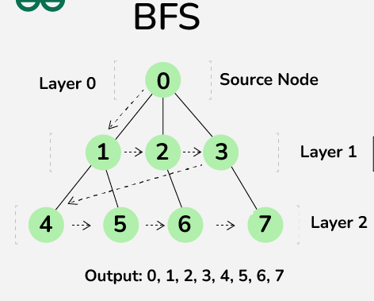
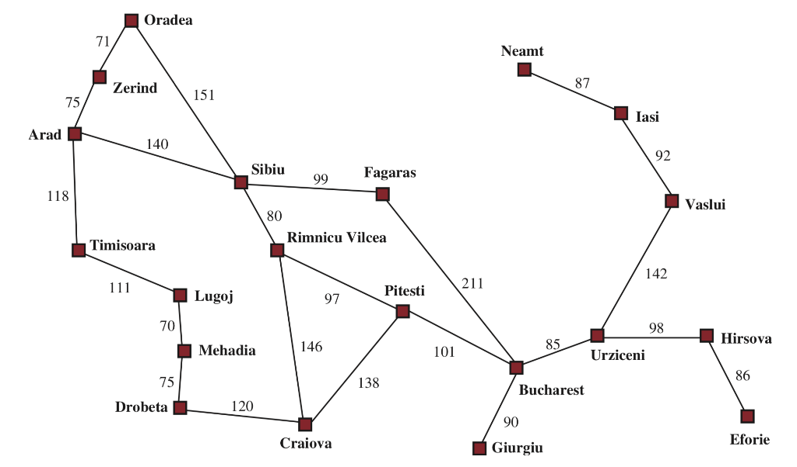

# Breadth-First Search (BFS) for Romania Roadmap

## Define BFS

Breadth-First Search (BFS) is an algorithm used for traversing or searching tree or graph data structures. It explores all neighbor nodes at the present depth level before moving on to nodes at the next level of depth. BFS uses a queue (FIFO - First-In-First-Out) for traversal.

## Define the Problem of Romania Roadmap

The problem involves finding a path from a starting city to a destination city in Romania using a given roadmap represented as a graph.

## Explain The Algorithm Steps

### Initialization

- Initialize a queue (`frontier`) with the start node.
- Initialize a dictionary (`visited`) to keep track of visited nodes.
- Initialize a dictionary (`came_from`) to track the path from each node back to its predecessor.

### BFS Traversal

- While the queue `frontier` is not empty:
  - Dequeue the node at the front (`current`) of the queue.
  - If `current` is the goal node, reconstruct the path using `came_from` and return it.
  - Otherwise, iterate through each neighbor of `current`:
    - If a neighbor hasn't been visited, mark it as visited, set its predecessor (`came_from`), and enqueue it.

### Path Reconstruction

- If the goal node is found, reconstruct the path from start to goal using the `came_from` dictionary.

## Explain Code Structure

### Graph Representation

The roadmap (graph) is represented as a dictionary (`graph`) where keys are cities (nodes) and values are sets of neighboring cities (connected nodes).

### `bfs_search` Function

- **Input Parameters:**
  - `graph`: The graph represented as an adjacency list.
  - `start`: The starting city.
  - `goal`: The destination city.
- **Output:**
  - Returns a path (list of cities) from `start` to `goal` if one exists, otherwise returns `None`.

## How to Run the Code

### Prerequisites

- Ensure you have Python installed on your computer. If not, download and install Python from the [official website](https://www.python.org/).

### Steps to Run the Code

1. **Download the Code:**
   - Download the Python script containing the `bfs_search` function and the graph representation (roadmap). Save it to your computer.

2. **Open a Text Editor:**
   - Use any text editor (e.g., Notepad, VS Code, Sublime Text) to open the downloaded Python script.

3. **Edit Start and Goal Cities:**
   - Locate the part of the script where the start and goal cities are defined.
   - Modify the `start` and `goal` variables to specify your desired starting and destination cities within the Romania roadmap.

4. **Run the Script:**
   - Execute the Python script using a terminal or command prompt: `python script_name.py`.

## Conclusion

This BFS implementation provides a method to navigate the Romania roadmap (graph) to find routes between cities. BFS guarantees finding the shortest path in an unweighted graph. The provided code demonstrates how to apply BFS to solve pathfinding problems efficiently in a graph-based context.
